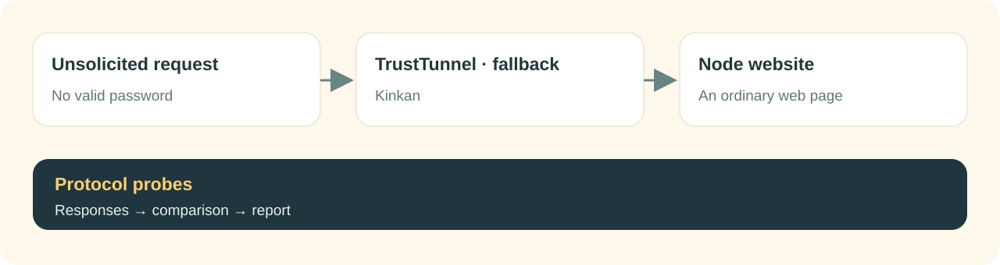

<div align="center">

<picture>
  <source media="(prefers-color-scheme: dark)" srcset="../.github/assets/kinkan/banner-en-dark.svg">
  
</picture>

**A VPN panel on [mihomo](https://github.com/MetaCubeX/mihomo) that helps you understand what an unsolicited probe reveals about your node.**

[](https://github.com/GetsuNoKaze/kinkan/releases)
[](https://github.com/GetsuNoKaze/kinkan/actions/workflows/tt-check.yml)
[](../LICENSE)

[Русский](../README.md) · **English**

</div>

Kinkan is an independent fork of [Mikan](https://github.com/Miroshka000/mikan). It keeps the familiar panel, users, plans, subscriptions, Telegram bot and multiple nodes. The fork adds node websites, unauthenticated protocol probes and a scanner journal, so you can decide which connections to keep using measurements.

## What Kinkan adds

| Feature | What it does for you |
|---|---|
| **Your website on each node** | Upload a static ZIP and assign it to a node. The panel sends it and the node serves it, without a separate Caddy. Duplicate websites and titles receive a warning. |
| **TrustTunnel fallback** | With fallback configured, visitors without valid credentials see your website instead of `407 Proxy Authentication Required`. ALPN and HTTP/2 behavior are adjusted too. Once the node confirms the site is ready, the panel connects it to TrustTunnel automatically. |
| **Protocol probes** | Check enabled inbounds from the panel or CLI: TLS, HTTP, QUIC and random bytes. Each gets a verdict and downloadable findings. |
| **Scanner journal** | See failed attempts by IP, inbound and day, with country/network metadata when available, scanner attribution hints and spike alerts. Likely client errors are marked separately. |



This does not guarantee an invisible VPN. Current journal hooks cover TrustTunnel, rejected REALITY handshakes, TUIC, wrong AnyTLS authentication and Hysteria2 authentication requests. Other protocols and errors before obfuscation/QUIC completes are not fully covered. Silence alone never establishes stealth. A **Quiet** verdict requires a comparison with the same cover website. [Coverage and limitations](../PROBE-PROTOCOLS.md).

The journal stores failure metadata, not passwords or user traffic content. Records are aggregated by IP, retained for 30 days and bounded in number. A scanner name is an attribution hint rather than a verified identity.

## See the interface

These are inherited Mikan demo screenshots of the shared interface. The new Kinkan website, probe and journal screens are not shown here.

<table>
<tr><td width="50%"></td><td width="50%"></td></tr>
<tr><td></td><td></td></tr>
</table>

[](../.github/assets/kinkan/tour-ru.mp4)

[Watch the 16-second MP4 tour](../.github/assets/kinkan/tour-ru.mp4), without audio. This is a slideshow of demo screenshots, not a live server recording.

## Install

On a fresh **Ubuntu 22.04+ or Debian 12+** server, **amd64 or arm64**:

```bash
curl -fsSL https://github.com/GetsuNoKaze/kinkan/releases/latest/download/install.sh | sudo bash
```

The installer verifies the signed release and checksum, guides setup and prints the admin link. It installs Kinkan's image, `ghcr.io/getsunokaze/kinkan`.

For a remote node, copy its join command from the panel's **Nodes** page:

```bash
curl -fsSL https://github.com/GetsuNoKaze/kinkan/releases/latest/download/install.sh | sudo bash -s -- --join YOUR_JOIN_KEY
```

Replace `YOUR_JOIN_KEY` with the panel's key. Run Kinkan on both panel and nodes. For an existing Mikan or early Kinkan installation, back up first and follow [the migration and update guide](../RELEASE-TT.md), including compatibility considerations for a rollback.

## First steps

1. Open the admin link and configure users and inbounds.
2. Upload a static site in **Node website**, assign it to a node and wait for its ready status. The panel explains the required files.
3. Run **Nodes → Check protocols**. Set a reference HTTPS port showing the same website; specify its hostname separately if it differs from the inbound's TLS name.
4. Review each verdict and the scanner journal. **Inconclusive** means there is not enough evidence, even if some probes succeeded.

Panel probes originate from the panel server. Run the CLI from another network when you need that perspective:

```bash
kinkan probe --protocol tuic --json https://node.example.com:8443
kinkan probe --protocol vless --reference https://cover.example.com:8444 https://node.example.com:443
```

## The familiar Mikan features

Users and plans, client-specific subscriptions, Telegram bot and Mini App, supported payment providers, multiple nodes, WARP and cascades, HTTPS, 2FA, audit, backups and an integration API remain available. Protocol support includes VLESS/REALITY, Trojan, Hysteria2, TUIC, AnyTLS, TrustTunnel and others; client compatibility and per-user accounting vary by protocol. See [Mikan's compatibility table](https://github.com/Miroshka000/mikan#protocols).

Run `kinkan` for the server menu, `kinkan status` for service health, `kinkan update` for fork releases, `kinkan backup` for backups, and `kinkan url` for the admin link. The `mikan` command also keeps working. Kinkan has its own signing key and release channel; upstream changes are synchronized through checked pull requests.

## Documentation and credits

- [Fork details](../FORK.md), [releases and migration](../RELEASE-TT.md), [protocol probes and journal](../PROBE-PROTOCOLS.md).
- [TrustTunnel probes](../PROBE-TT.md), [changelog](../CHANGELOG-TT.md), [roadmap](../ROADMAP.md), [report an issue](https://github.com/GetsuNoKaze/kinkan/issues).
- Developers: run `scripts/tt/check.sh`; the full Go suite requires disposable PostgreSQL. Core changes belong in `patches/mihomo/` and are rebuilt with `scripts/tt/mihomo.sh`.

Kinkan (金柑, kumquat) builds on Mikan by Miroshka000 and mihomo by MetaCubeX. It is not affiliated with either project. Code is licensed under [GNU GPL v3](../LICENSE). Demo screenshots come from Mikan; banners, diagrams and the screenshot video tour were made for Kinkan. Other translated READMEs still document upstream Mikan, including its installer commands.
