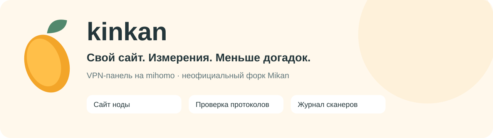
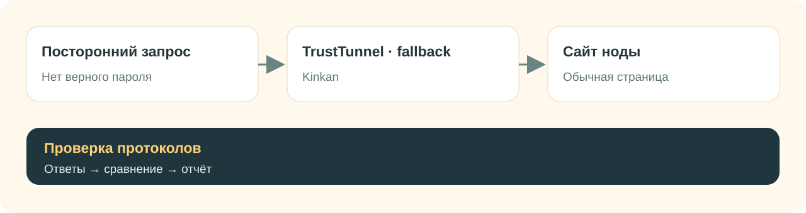
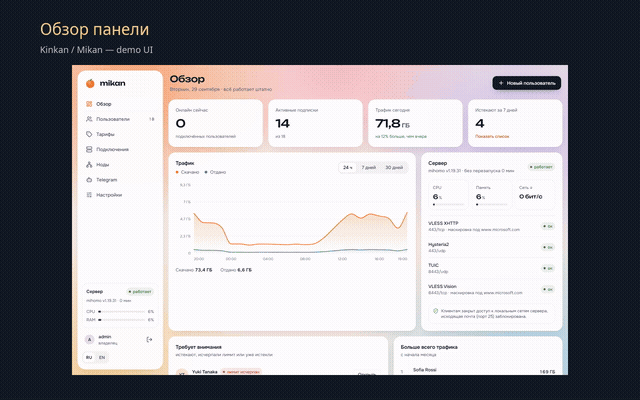

<div align="center">

<picture>
  <source media="(prefers-color-scheme: dark)" srcset="../.github/assets/kinkan/banner-ru-dark.svg">
  
</picture>

**VPN-панель на [mihomo](https://github.com/MetaCubeX/mihomo), которая помогает понять, что выдаёт вашу ноду при сканировании.**

[](https://github.com/GetsuNoKaze/kinkan/releases)
[](https://github.com/GetsuNoKaze/kinkan/actions/workflows/tt-check.yml)
[](https://github.com/GetsuNoKaze/kinkan/pkgs/container/kinkan)
[](../LICENSE)

**Русский** · [English](../README.en.md)

[Установить](#установка) · [Что добавляет Kinkan](#что-добавляет-kinkan) · [Посмотреть интерфейс](#как-это-выглядит) · [Документация](#документация)

</div>

Kinkan — неофициальный форк [Mikan](https://github.com/Miroshka000/mikan). Здесь есть привычная панель: пользователи, тарифы, подписки, Telegram-бот и несколько серверов под одним управлением. Мы развиваем её в сторону **«тихой ноды»**: своего сайта на сервере, проверки ответов без пароля и журнала посторонних обращений.

Идея простая: сканер может прийти на VPN-порт как обычный посетитель. Ответ «нужна авторизация прокси» выдаёт назначение порта. Kinkan помогает убрать такие ответы там, где это уже реализовано, и измерить остальные подключения. Решение о том, какой протокол оставить, вы принимаете по отчёту.

## Что добавляет Kinkan

<table>
<tr>
<td width="50%" valign="top">

### 🌐 Ваш сайт на каждой ноде
Загрузите ZIP со статическим сайтом, выберите ноду — панель передаст ей архив. Нода сама отдаёт сайт, отдельный Caddy для этого не нужен. Можно использовать разные страницы на разных серверах; панель предупреждает об одинаковых сайтах и заголовках.

</td>
<td width="50%" valign="top">

### 🍊 TrustTunnel с обычной страницей
С настроенным fallback посетитель без верных учётных данных получает ваш сайт вместо `407 Proxy Authentication Required`. Учтены ALPN и поведение HTTP/2. После подтверждения готовности сайта панель подключает его к TrustTunnel автоматически.

</td>
</tr>
<tr>
<td valign="top">

### 🔎 Проверка глазами сканера
Один запуск в панели проверяет включённые подключения: TLS, HTTP, QUIC и реакцию на случайные байты. Для каждого — свой результат: «Тихий», «Заметный», «Палится» или «Недостаточно данных». Отчёт можно скачать в JSON; та же проверка доступна из командной строки.

</td>
<td valign="top">

### 📊 Кто стучался без пароля
Журнал показывает адрес, подключение, время и число отказов. При доступных данных добавляет страну, сеть, организацию и подсказку об известном сканере. Есть график по дням и предупреждение о всплеске. Ошибки вероятных своих клиентов отмечаются отдельно.

</td>
</tr>
</table>

<p align="center"></p>

**Что важно знать.** Эти возможности не делают любой VPN невидимым. Журнал сейчас охватывает TrustTunnel, отказы REALITY, TUIC, неверную авторизацию AnyTLS и запросы авторизации Hysteria2. Маскировка obfs, часть ошибок и остальные протоколы ещё не имеют полного покрытия. Таймаут не считается признаком скрытности; для итога «Тихий» нужен сайт для сравнения. [Подробности замеров и ограничений →](../PROBE-PROTOCOLS.md)

Журнал хранит метаданные отказов, без паролей и содержимого пользовательского трафика. Записи агрегируются по IP, хранятся 30 дней и ограничены по количеству. Название сканера — оценка по доступным признакам, а не доказанная личность посетителя.

## Как это выглядит

Это демо-скриншоты базового интерфейса, унаследованного от Mikan. В Kinkan к нему добавлены сайт ноды, проверка протоколов и журнал сканеров; эти новые экраны ниже не показаны.

<table>
<tr>
<td width="50%"><br><b>Всё важное на одном экране</b></td>
<td width="50%"><br><b>Пользователи и подписки</b></td>
</tr>
<tr>
<td><br><b>Подключения на ваших нодах</b></td>
<td><br><b>Telegram-бот в панели</b></td>
</tr>
</table>

<p align="center">

&nbsp;&nbsp;

</p>

### Короткий видеообзор

[](../.github/assets/kinkan/tour-ru.mp4)

[Открыть видео MP4 · 16 секунд, без звука](../.github/assets/kinkan/tour-ru.mp4). Это обзор по демо-скриншотам, а не запись работающего сервера. Анимация выше показывает те же четыре экрана прямо в README.

## Установка

На новом сервере с **Ubuntu 22.04+ или Debian 12+**, архитектура **amd64 или arm64**:

```bash
curl -fsSL https://github.com/GetsuNoKaze/kinkan/releases/latest/download/install.sh | sudo bash
```

Установщик проверяет подпись релиза и контрольную сумму, проводит через настройку и выдаёт ссылку администратора. Это команда установки **Kinkan**, с образом `ghcr.io/getsunokaze/kinkan`.

Чтобы добавить отдельную ноду, откройте **«Ноды»** в панели и скопируйте команду подключения с её ключом. Общий вид команды:

```bash
curl -fsSL https://github.com/GetsuNoKaze/kinkan/releases/latest/download/install.sh | sudo bash -s -- --join YOUR_JOIN_KEY
```

`YOUR_JOIN_KEY` замените ключом из панели. На панели и нодах нужен Kinkan, чтобы настройки форка работали везде.

Уже пользуетесь Mikan или ранним Kinkan? Сначала сохраните бэкап и прочитайте [порядок перехода и обновления](../RELEASE-TT.md). Для существующей установки есть особенности совместимости; обратный переход требует учитывать добавленные форком данные.

## Первый запуск: от панели к своей ноде

1. Откройте ссылку администратора, которую выдал установщик, и настройте пользователей и подключения.
2. В разделе **«Сайт ноды»** загрузите свой статический сайт. Нужны `index.html`, `404.html`, `robots.txt` и favicon; конкретные требования показаны в панели. Выберите его для нужной ноды и дождитесь статуса готовности.
3. Откройте **«Ноды → Проверка протоколов»**. Для сравнения укажите HTTPS-порт эталонного сайта, который показывает ту же страницу. Если его TLS-имя отличается, задайте его отдельно. Не используйте случайный чужой сайт как эталон.
4. Посмотрите результаты по каждому подключению и **«Журнал сканеров»**. Отмеченные различия стоит разобрать; «Недостаточно данных» означает, что измерений для вывода не хватило.

Запросы из панели идут с сервера панели. Если важен результат из другой сети, запустите CLI оттуда:

```bash
kinkan probe --protocol tuic --json https://node.example.com:8443
kinkan probe --protocol vless --reference https://cover.example.com:8444 https://node.example.com:443
```

CLI подключается к адресам, которые вы указали. Примеры, проверка нескольких inbound'ов и закрепление IP — в [руководстве по сканеру](../PROBE-PROTOCOLS.md).

## Всё привычное из Mikan

- **Пользователи и тарифы:** время, трафик, устройства и ограничения доступа.
- **Подписки под приложение:** клиент получает совместимые с ним подключения.
- **Telegram-бот и Mini App:** подписка, уведомления, покупка и продление с поддерживаемыми способами оплаты.
- **Несколько нод, WARP и каскады:** управление серверами и маршрутами из одной панели.
- **Безопасность и обслуживание:** HTTPS, двухфакторная авторизация, аудит, бэкапы и API для интеграций.

Поддерживаются VLESS/REALITY с Vision, XHTTP и gRPC, Trojan, Hysteria2, TUIC, AnyTLS, TrustTunnel, ShadowQUIC и другие протоколы Mikan. Совместимость зависит от приложения и версии его ядра. У протоколов с общим ключом есть ограничения учёта по пользователям — [таблица совместимости Mikan](https://github.com/Miroshka000/mikan#protocols).

## Управление сервером

Команда `kinkan` открывает меню. Привычная команда `mikan` тоже продолжает работать.

| Команда | Для чего |
|---|---|
| `kinkan status` | Состояние сервисов и версии |
| `kinkan update` | Обновление из релизов Kinkan |
| `kinkan backup` | Сохранение резервной копии |
| `kinkan logs panel` / `kinkan logs node` | Логи панели или ноды |
| `kinkan url` | Ссылка администратора |
| `kinkan probe …` | Активная проверка подключений |

У форка свои подписанные релизы и ключ проверки. Изменения Mikan регулярно проходят автоматическую синхронизацию в отдельном pull request, с проверками перед слиянием.

## Документация

| Хочу… | Куда смотреть |
|---|---|
| Понять отличия от Mikan | [FORK.md](../FORK.md) |
| Установить, обновить или перейти с Mikan | [RELEASE-TT.md](../RELEASE-TT.md) |
| Разобраться с проверками и журналом | [PROBE-PROTOCOLS.md](../PROBE-PROTOCOLS.md) |
| Проверить TrustTunnel подробнее | [PROBE-TT.md](../PROBE-TT.md) |
| Узнать, что изменилось | [CHANGELOG-TT.md](../CHANGELOG-TT.md) |
| Посмотреть планы | [ROADMAP.md](../ROADMAP.md) |
| Сообщить об ошибке | [Issues Kinkan](https://github.com/GetsuNoKaze/kinkan/issues) |

Для разработчиков: `scripts/tt/check.sh` проверяет изменения форка; полному Go-набору тестов нужна одноразовая PostgreSQL. Патчи ядра хранятся в `patches/mihomo/`, копия пересобирается через `scripts/tt/mihomo.sh`.

## Авторы и лицензия

Kinkan (金柑 — кумкват) построен на [Mikan](https://github.com/Miroshka000/mikan) от Miroshka000 и [mihomo](https://github.com/MetaCubeX/mihomo) от MetaCubeX. Спасибо авторам за основу проекта и интерфейс. Форк независимый: вопросы об изменениях Kinkan направляйте в этот репозиторий.

Код распространяется по [GNU GPL v3](../LICENSE). Демо-скриншоты взяты из Mikan; баннеры, схема и видеообзор собраны для Kinkan. Другие языковые README в репозитории пока сохраняют документацию исходного Mikan, включая его команды установки.

<div align="center"><sub>🍊 Свой сайт на ноде. Измерения перед выводами.</sub></div>
